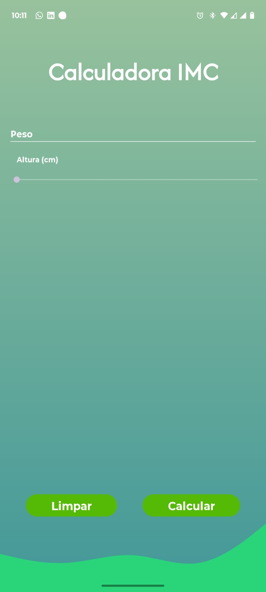
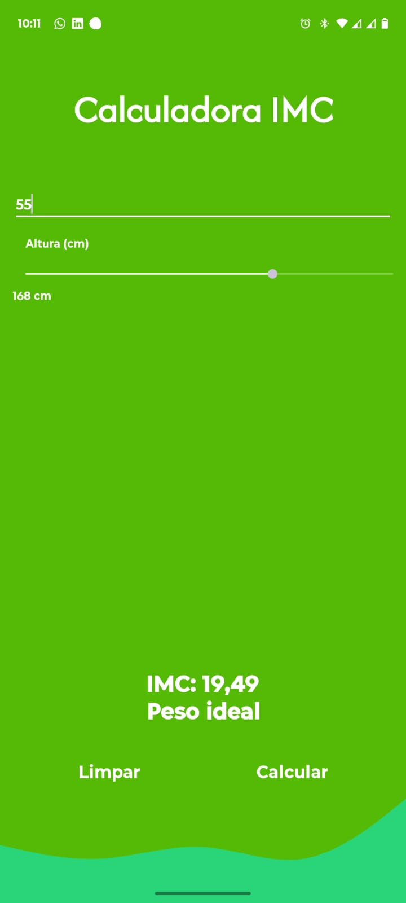
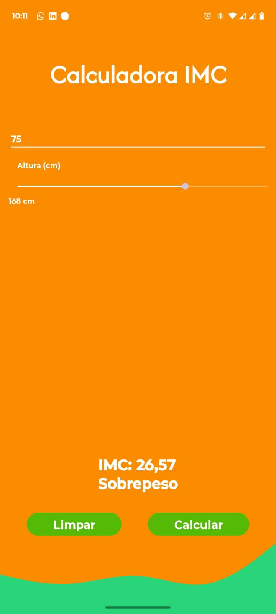
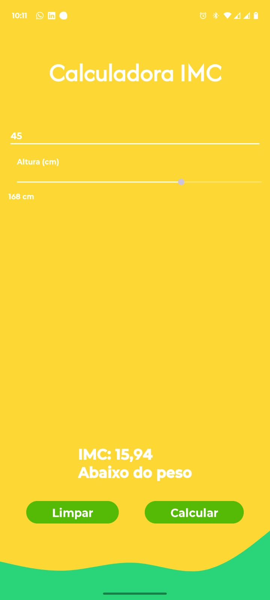
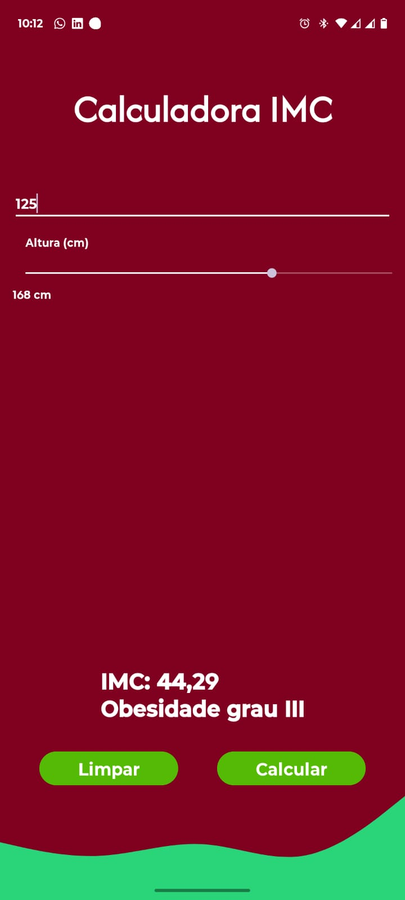

# 📱 Calculadora IMC Android

Aplicativo Android desenvolvido em **Kotlin** para cálculo de IMC (Índice de Massa Corporal), com interface moderna, responsiva e feedback visual dinâmico baseado no resultado do usuário.

---

## 🚀 Funcionalidades

✅ Cálculo automático de IMC
✅ Classificação por faixa de peso
✅ Alteração dinâmica de cores conforme resultado
✅ Interface responsiva
✅ Controle de altura com SeekBar
✅ Limpeza rápida dos campos
✅ APK disponível para download

---

## 🛠️ Tecnologias utilizadas

* Kotlin
* Android Studio
* ConstraintLayout
* Material Design
* Gradle

---

## 📸 Screenshots

### Tela inicial



---

### Peso ideal



---

### Sobrepeso



---

### Abaixo do peso



---

### Obesidade Grau III



---

## 📦 Download APK

Baixe o aplicativo Android:

[📥 Download APK](./releases/calculadora-imc-v1.apk)

---

## ▶️ Como executar o projeto

Clone o repositório:

```bash
git clone https://github.com/Aledrizzato78/calculadora-imc-android-kotlin.git
```

Abra no Android Studio e execute em um dispositivo físico ou emulador Android.

---

## 🎯 Objetivos do projeto

Este projeto foi desenvolvido com foco em:

* aprendizado prático de desenvolvimento Android
* evolução em Kotlin
* manipulação de interface gráfica
* gerenciamento de estados visuais
* construção de portfólio mobile

---

## 🔥 Melhorias futuras

* Histórico de cálculos
* Dark Mode
* Internacionalização
* Persistência local com Room
* Animações e transições
* Publicação na Play Store

---

## 👨‍💻 Autor

Alexandre Drummond Rizzato

* GitHub: https://github.com/Aledrizzato78
* LinkedIn: https://www.linkedin.com/in/alexandre-drummond-rizzato-524a3724

---
